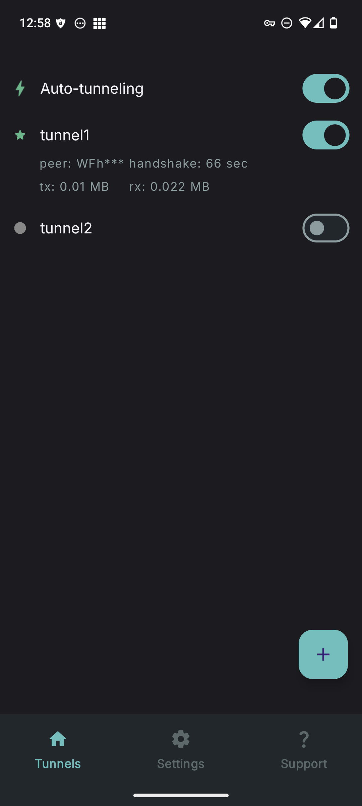
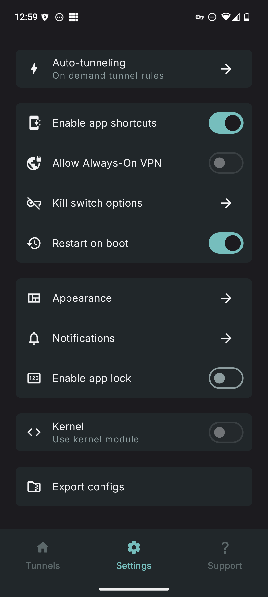
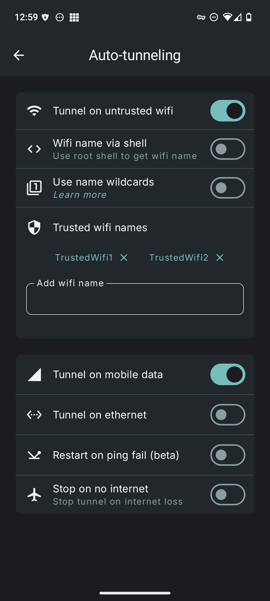
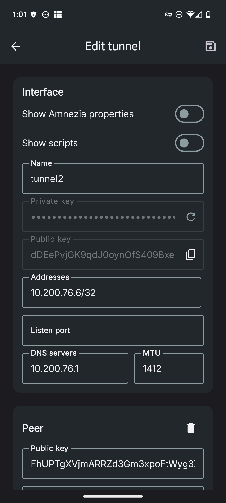

<h1 align="center">
WG Tunnel
</h1>

<div align="center">

An alternative FOSS Android client for [WireGuard](https://www.wireguard.com/)
and [AmneziaWG](https://docs.amnezia.org/documentation/amnezia-wg/)
<br />
<br />
<a href="https://github.com/zaneschepke/wgtunnel/issues/new?assignees=zaneschepke&labels=bug&projects=&template=bug_report.md&title=%5BBUG%5D+-+Problem+with+app">Report a Bug</a>
·
<a href="https://github.com/zaneschepke/wgtunnel/issues/new?assignees=zaneschepke&labels=enhancement&projects=&template=feature_request.md&title=%5BFEATURE%5D+-+New+feature+request">Request a Feature</a>
·
<a href="https://github.com/zaneschepke/wgtunnel/discussions">Ask a Question</a>

</div>

<br/>

<div align="center">

[](https://play.google.com/store/apps/details?id=com.zaneschepke.wireguardautotunnel)
[](https://f-droid.org/packages/com.zaneschepke.wireguardautotunnel/)
[](https://github.com/zaneschepke/fdroid)
[](https://apps.obtainium.imranr.dev/redirect?r=obtainium://app/%7B%22id%22%3A%22com.zaneschepke.wireguardautotunnel%22%2C%22url%22%3A%22https%3A%2F%2Fgithub.com%2Fzaneschepke%2Fwgtunnel%22%2C%22author%22%3A%22zaneschepke%22%2C%22name%22%3A%22WG%20Tunnel%22%2C%22preferredApkIndex%22%3A0%2C%22additionalSettings%22%3A%22%7B%5C%22includePrereleases%5C%22%3Afalse%2C%5C%22fallbackToOlderReleases%5C%22%3Atrue%2C%5C%22filterReleaseTitlesByRegEx%5C%22%3A%5C%22%5C%22%2C%5C%22filterReleaseNotesByRegEx%5C%22%3A%5C%22%5C%22%2C%5C%22verifyLatestTag%5C%22%3Atrue%2C%5C%22sortMethodChoice%5C%22%3A%5C%22date%5C%22%2C%5C%22useLatestAssetDateAsReleaseDate%5C%22%3Afalse%2C%5C%22releaseTitleAsVersion%5C%22%3Afalse%2C%5C%22trackOnly%5C%22%3Afalse%2C%5C%22versionExtractionRegEx%5C%22%3A%5C%22%5C%22%2C%5C%22matchGroupToUse%5C%22%3A%5C%22%5C%22%2C%5C%22versionDetection%5C%22%3Atrue%2C%5C%22releaseDateAsVersion%5C%22%3Afalse%2C%5C%22useVersionCodeAsOSVersion%5C%22%3Afalse%2C%5C%22apkFilterRegEx%5C%22%3A%5C%22%5C%22%2C%5C%22invertAPKFilter%5C%22%3Afalse%2C%5C%22autoApkFilterByArch%5C%22%3Atrue%2C%5C%22appName%5C%22%3A%5C%22WG%20Tunnel%5C%22%2C%5C%22appAuthor%5C%22%3A%5C%22Zane%20Schepke%5C%22%2C%5C%22shizukuPretendToBeGooglePlay%5C%22%3Afalse%2C%5C%22allowInsecure%5C%22%3Afalse%2C%5C%22exemptFromBackgroundUpdates%5C%22%3Afalse%2C%5C%22skipUpdateNotifications%5C%22%3Afalse%2C%5C%22about%5C%22%3A%5C%22%5C%22%2C%5C%22refreshBeforeDownload%5C%22%3Afalse%7D%22%2C%22overrideSource%22%3Anull%7D)

</div>

<div align="center">

[](https://t.me/wgtunnel)
[](https://matrix.to/#/#wg-tunnel-space:matrix.org)
</div>

<details open="open">
<summary>Table of Contents</summary>

- [About](#about)
- [Screenshots](#screenshots)
- [Features](#features)
- [Building](#building)
- [Translation](#translation)
- [Acknowledgements](#acknowledgements)
- [Contributing](#contributing)

</details>

<div style="text-align: left;">

## About

WG Tunnel is an alternative Android client for WireGuard and AmneziaWG, inspired by the official WireGuard Android app. It fills gaps in the official client by adding advanced features like auto-tunneling (on-demand VPN activation), while seamlessly supporting both protocols across app modes—including Kernel (for direct WireGuard kernel integration; AmneziaWG not supported), VPN (standard system-level tunneling), Lockdown (a custom kill switch for leak prevention), and Proxy (built-in HTTP/SOCKS5 forwarding)—for enhanced privacy, censorship resistance, and flexibility.

</div>

<div style="text-align: left;">

## Screenshots

</div>
<div style="display: flex; flex-wrap: wrap; justify-content: left; gap: 10px;">
 
 
  
  
</div>

<div style="text-align: left;">

## Features

- **Tunnel Import Methods**: Easily add tunnels using .conf files, ZIP archives, manual entry, or QR code scanning.
- **Auto-Tunneling**: Automatically activate tunnels based on Wi-Fi SSID, Ethernet connections, or mobile data networks.
- **Split Tunneling**: Flexible support for routing specific apps or traffic through the VPN.
- **WireGuard Modes**: Full compatibility with WireGuard in both kernel and userspace implementations.
- **AmneziaWG Integration**: Userspace mode for AmneziaWG, providing robust censorship evasion.
- **Always-On VPN**: Ensures continuous protection with Android's Always-On VPN feature.
- **Quick Controls**: Quick Settings tile and home screen shortcuts for easy VPN toggling.
- **Automation Support**: Intent-based automation for controlling tunnels.
- **Auto-Restore**: Seamlessly restores auto-tunneling and active tunnels after device restarts or app updates.
- **Proxying Options**: Built-in HTTP and SOCKS5 proxy support within tunnels.
- **Lockdown Mode**: Custom kill switch for maximum leak prevention and security.
- **Dynamic DNS Handling**: Detects and updates DNS changes without tunnel restarts.
- **Monitoring Tools**: Advanced tunnel monitoring features for tunnel performance monitoring.
- **Android TV Support**: Android TV support for secure streaming and browsing.
- **Advanced DNS**: DNS over HTTPS support for tunnel endpoint resolutions.

## Building

```sh
git clone https://github.com/wgtunnel/wgtunnel
cd wgtunnel
```

```sh
./gradlew assembleDebug
```

## Translation

This app is using [Weblate](https://weblate.org) to assist with translations.

Help translate WG Tunnel into your language
at [Hosted Weblate](https://hosted.weblate.org/engage/wg-tunnel/).\
[](https://hosted.weblate.org/engage/wg-tunnel/)

## Acknowledgements

Thank you to the following:

- All of the users that have helped contribute to the project with ideas, translations, feedback, bug reports, testing, and donations.
- [WireGuard](https://www.wireguard.com/) - Jason A. Donenfeld (https://github.com/WireGuard/wireguard-android)
- [AmneziaWG](https://docs.amnezia.org/documentation/amnezia-wg/) - Amnezia Team (https://github.com/amnezia-vpn/amneziawg-android)
- [JetBrains](https://jetbrains.com) - For supporting open-source developers with free software licenses.

## Contributing

Any contributions in the form of feedback, issues, code, or translations are welcome and much
appreciated!

Please read
the [code of conduct](https://github.com/zaneschepke/wgtunnel?tab=coc-ov-file#contributor-code-of-conduct)
before contributing.
